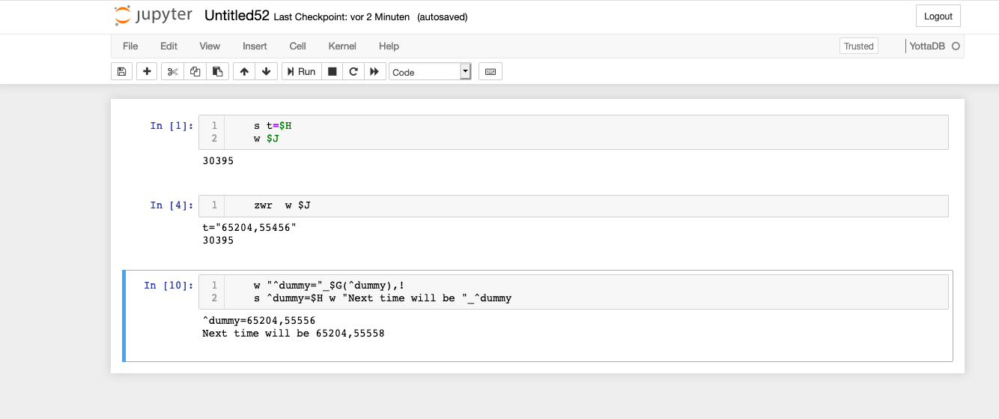

# YottaDB-kernel for Jupyter Notebook

## Description

This is forked version of a kernel for the M-Language in YottaDB tailored to run with VistA

https://yottadb.com/

https://docs.yottadb.com/ProgrammersGuide/index.html

http://vistadataproject.info/



## Installation

To install `yottadb_kernel` from source:

```
python setup.py install
python -m yottadb_kernel.install
```

Make sure that the YottaDB environment variables are set!

The following command must work in order to use the kernel:

```
$ydb_dist/ydb
```

Type the command as is and don't expand the `ydb_dist` variable in the
command above!

## Using the YottaDB kernel

**Notebook**: The *New* menu in the notebook should show an option for an
YottaDB notebook.

**Console frontends**: To use it with the console frontends, add
`--kernel yottadb` to their command line arguments.

## Docker Container

A docker container of VistA integrated with Jupyter is available. 

To run:

    docker run -d -p 8888:8888 ramb0/vistajupyter
  
To run with persistent storage, create a directory i.e. /opt/jupyterdir and then:

    docker run -d -p 8888:8888 -v /opt/jupyterdir:/home/jupyter ramb0/vistajupyter
    
Then navigate to the Jupyter browser on http://ip-address-of-docker-server:8888
  
Enter the password **test**
